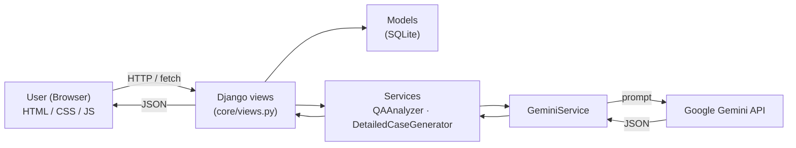

# Automated Requirements Analysis and Test Scenario Generation

An AI-powered web application that reads software requirements, evaluates their
quality, and generates traceable test conditions, test scenarios, and detailed
test cases — with real-time team collaboration.

> Final Year Project — Multimedia University (MMU), Faculty of Computing and Informatics.
> Author: **Lee Dick Xen** (243UC247HK).

---

## Features

- **AI requirement analysis** — extracts actors, actions, business rules, constraints,
  validation rules, error handling, and non-functional requirements.
- **Multi-requirement support** — splits input into REQ-001, REQ-002, … each with its
  own analysis and its own quality scores.
- **Quality scoring** — Clarity / Completeness / Testability / Overall (0–100) with a
  High / Medium / Low severity, per requirement and overall.
- **Traceable test artifacts** — test conditions, requirement review findings (gaps),
  and test scenarios, each linked back to its requirement.
- **Detailed test cases** — expand any scenario into test data + step-by-step instructions,
  with per-step "done" checkboxes (saved & shared).
- **Exports** — full QA report as PDF, Excel, or CSV.
- **Team collaboration** — shared team workspaces: add/remove members, join by link,
  collaborative input (everyone edits, anyone generates), live team notes, and shared
  test-progress tracking.
- **Accounts** — register/login with email *or* username; passwords validated for strength.

---

## Tech stack

| Layer | Technology |
|-------|------------|
| Backend | Python 3.11, Django 5.1 |
| AI / LLM | Google Gemini (`google-generativeai`) |
| Database | SQLite |
| Frontend | HTML, CSS, vanilla JavaScript |
| Reports | ReportLab (PDF), openpyxl (Excel) |
| Serving | Gunicorn + WhiteNoise |

---

## Architecture



**Request flow for an analysis:**

1. User submits a requirement.
2. `QAAnalyzer` builds a prompt and calls `GeminiService`.
3. Gemini returns one JSON report (requirements, scores, conditions, gaps, scenarios).
4. `TrainingDataManager` saves it to the database.
5. The view returns JSON; the browser renders the 6-section report.

---

## Project structure

```
fyp_project/         # Django project settings, urls, wsgi
core/
  models.py          # Workspace, AnalysisSession, TestScenario, ...
  views.py           # all endpoints (analysis, exports, collaboration)
  urls.py
  forms.py           # register / login
  services/
    gemini_service.py        # Gemini API wrapper + error handling
    qa_analyzer.py           # main analysis prompt + JSON parser
    detailed_case_generator.py
    training_data_manager.py # saves analysis results to the DB
  templates/         # home, login, register, workspace
  static/            # style.css, workspace.js
  tests.py           # automated tests
```

---

## Local setup

```bash
# 1. Install dependencies (Python 3.11)
pip install -r requirements.txt

# 2. Create a .env file in the project root:
#    SECRET_KEY=any-long-random-string
#    DEBUG=True
#    GEMINI_API_KEY=your-gemini-api-key
#    (get a key at https://aistudio.google.com)

# 3. Set up the database
python manage.py migrate

# 4. Run
python manage.py runserver
```

Open http://127.0.0.1:8000

---

## Running tests

```bash
python manage.py test core
```

---

## Deployment (Render)

- **Build command:** `pip install -r requirements.txt && python manage.py collectstatic --noinput`
- **Start command:** `gunicorn fyp_project.wsgi:application`
- **Environment variables:**

| Variable | Value |
|----------|-------|
| `GEMINI_API_KEY` | your Gemini API key |
| `SECRET_KEY` | a long random string |
| `DEBUG` | `False` |
| `ALLOWED_HOSTS` | `your-app.onrender.com` |

When `DEBUG=False`, the app enforces production security (HTTPS redirect, secure
cookies, HSTS, proxy SSL header, and CSRF trusted origins from `ALLOWED_HOSTS`).

---

## Notes

- The Gemini API key lives only in environment variables — never commit it.
- `db.sqlite3` and `.env` are git-ignored.
